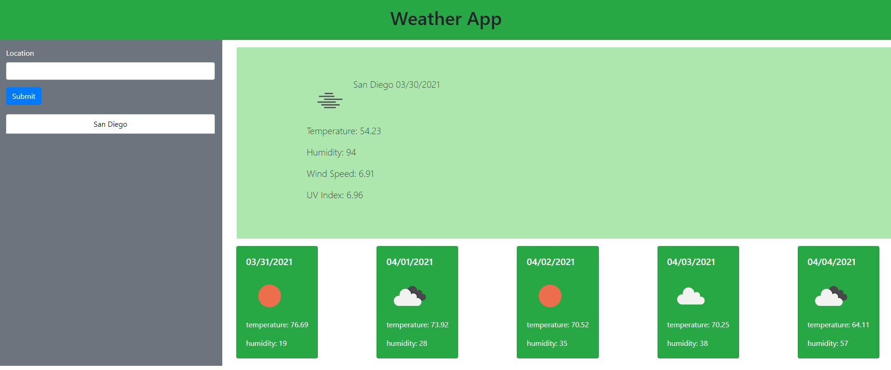

# Weather_Outlook
## Description
This app was created to help travelers know what kind of weather the cities they plan on visiting will have. Ranging from the current days weather forcast upto 5 days. 
The information from the app is provided as follows:
-Temperature
-Humidity
-Windspeed
-UV index
## Installation
You can enjoy this program at the following link: https://chrispayan.github.io/Weather_Outlook/
## Usage
The website when loaded should appear similar to the following image and is ready to retrieve information when requested.
    
## Credits
GitHub: eniqma, Total Entropy,